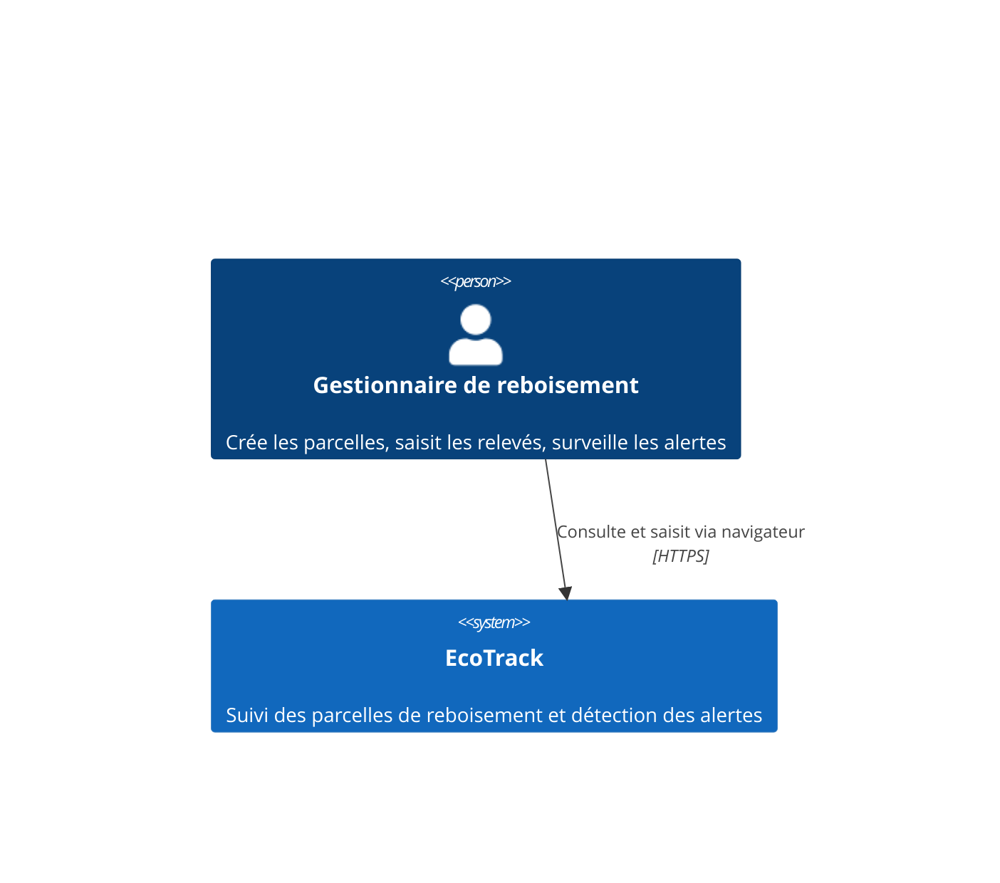
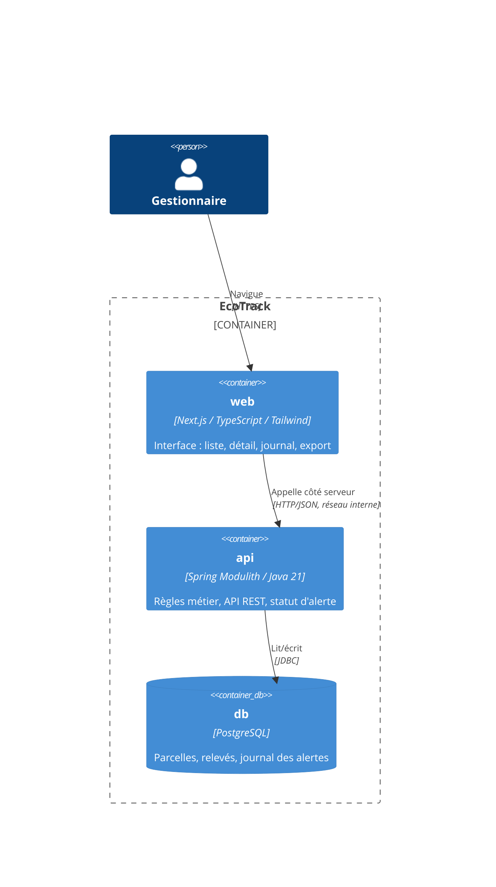
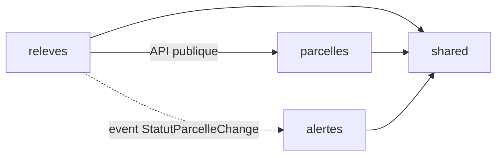

# SDD — EcoTrack : Document de Conception Logicielle
**Version 1.2 — statut : BROUILLON (corrective sécurité Wave 1 — revue adversariale v2 appliquée en pure documentation)**
Source de vérité fonctionnelle : `docs/srs.md` v1.3 · Décisions : `docs/adr/` · Conventions : `CLAUDE.md`

> Ce document dit **COMMENT** on réalise ce que le SRS a défini comme **QUOI**.
> Toute décision structurante y est justifiée par une ADR. Aucune exigence ne
> doit rester sans composant ni sans test (cf. matrice §8).

---

## 1. Vue d'ensemble

### 1.1 Contexte (C4 niveau 1)



Aucun système externe en v1 (cf. SRS §2.1) : pas d'intégration SI, pas de
notification sortante, pas d'authentification (arbitrage n°1).

### 1.2 Conteneurs (C4 niveau 2)



**Décision de routage** : le navigateur ne parle **qu'au conteneur `web`**.
Next.js relaie `/api/*` vers `http://api:8080` côté serveur (variable
`API_INTERNAL_URL`). Conséquences : aucune configuration CORS, aucune URL d'API
exposée au client, et en Phase 10 l'Ingress reprend ce rôle à l'identique.

---

## 2. Architecture backend : Spring Modulith

### 2.1 Découpage en modules

Trois modules applicatifs, un module technique partagé :

```
ci.ecotrack
├── parcelles/          # module : référentiel des parcelles
├── releves/            # module : relevés + calcul du taux + statut
├── alertes/            # module : journal des changements de statut
└── shared/             # types transverses (open module)
```

**ADR-001** justifie Modulith plutôt que microservices ou monolithe en couches.
Le principe structurant : **un module ne connaît d'un autre que son API publique
ou ses events**. `ApplicationModules.verify()` transforme cette règle en test
(§7.1) — elle n'est pas une convention, c'est un check du pipeline.

| Module | Responsabilité | API publique | Cache |
|---|---|---|---|
| `parcelles` | Cycle de vie et référentiel des parcelles, unicité du code, statut courant | `ParcelleService` (création, consultation, changement de statut), `ParcelleId`, `CodeParcelle` | Entités JPA, repository, contrôleurs |
| `releves` | Enregistrement des relevés, calcul du taux de survie, détermination du statut | `ReleveService` (enregistrer, historique) | Entités JPA, règles de calcul internes |
| `alertes` | Journal immuable des changements de statut, consultation | `JournalAlertesService` (consulter) | Entités JPA, écouteur d'events |
| `shared` | `TauxDeSurvie`, `StatutParcelle` — types de valeur partagés, sans logique de module | tout (open module) | — |

### 2.2 Dépendances et events



- `releves` → `parcelles` : **dépendance directe assumée** (API publique
  uniquement). Un relevé n'a pas de sens sans sa parcelle : il doit vérifier
  son existence et lire son nombre de plants initiaux.
- `releves` → `alertes` : **jamais de dépendance directe**, uniquement l'event
  `StatutParcelleChange`. `alertes` peut disparaître sans casser `releves` —
  et une v2 « notification email » s'abonnera au même event sans toucher au
  module émetteur. **ADR-003**.
- Aucun cycle. `shared` ne dépend de personne.

**L'event** (publié par `releves`, dans son API publique) :

```java
public record StatutParcelleChange(
    ParcelleId parcelleId,
    CodeParcelle code,
    StatutParcelle ancienStatut,
    StatutParcelle nouveauStatut,
    TauxDeSurvie tauxDeclencheur,
    LocalDate dateReleve,
    Instant survenuLe) {}
```

### 2.3 Structure interne d'un module (hexagonal allégé)

```
releves/
├── ReleveService.java              # API PUBLIQUE du module (seul point d'entrée)
├── domaine/                        # Java pur — AUCUN import Spring/JPA
│   ├── Releve.java                 # entité de domaine
│   ├── TauxDeSurvie.java           # VO (dans shared)
│   └── RegleStatutAlerte.java      # règle du seuil (EX-F-03)
├── application/
│   ├── EnregistrerReleveUseCase.java
│   └── port/ReleveRepository.java  # port de sortie (interface)
└── infrastructure/
    ├── rest/ReleveController.java  # adapter entrant
    └── jpa/                        # adapter sortant : entité JPA + mapper
```

Le domaine est testable sans contexte Spring, en millisecondes. Les adapters
sont remplaçables. C'est ce qui rend `EX-F-03` (règle du seuil, cas limites)
vérifiable par des tests unitaires purs.

---

## 3. Modèle de domaine (DDD)

### 3.1 Agrégats

**Agrégat `Parcelle`** (racine, module `parcelles`) — frontière de cohérence :
code unique, caractéristiques immuables, statut courant.

```java
public class Parcelle {
    private final ParcelleId id;
    private final CodeParcelle code;          // VO : format PRC-AAAA-NNN
    private final Localite localite;          // VO : 1..100 caractères
    private final Superficie superficie;      // VO : 0.01..10000, 2 décimales
    private final NombrePlants plantsInitiaux;// VO : entier > 0
    private final LocalDate datePlantation;
    private StatutParcelle statut;            // seul état mutable
}
```

**Agrégat `Releve`** (racine, module `releves`) — référence `Parcelle` **par
identité** (`ParcelleId`), jamais par objet : deux agrégats, deux transactions,
deux modules.

```java
public class Releve {
    private final ReleveId id;
    private final ParcelleId parcelleId;      // référence par ID
    private final LocalDate dateObservation;
    private final NombrePlants plantsVivants;
    private final TauxDeSurvie taux;          // calculé, jamais saisi (EX-NF-07)
}
```

**Agrégat `EntreeJournal`** (racine, module `alertes`) — immuable par
construction (aucun setter, aucune opération de modification exposée), ce qui
réalise EX-F-07 R1 au niveau du modèle et non par convention.

### 3.2 Objets-valeur et invariants

| VO | Invariant | Exigence |
|---|---|---|
| `CodeParcelle` | `^PRC-\d{4}-\d{1,3}$`, rejet à la construction | EX-F-01 R1 |
| `Localite` | non vide, ≤ 100 caractères ; **classe de caractères autorisée** `\p{L}\p{N}\p{P}\p{Z}` (lettres, chiffres, ponctuation, séparateurs Unicode) sauf caractères de contrôle (autorisés : `\t`, `\n`, `\r` uniquement). **Interdits explicitement** : null bytes (``), caractères directionnels Unicode (`U+202A`..`U+202E`, `U+2066`..`U+2069`) — vecteurs de log injection et de phishing par override RTL. **Correction SEC-B-06**. | EX-F-01 R4, SEC-B-06 |
| `Superficie` | `BigDecimal` ∈ [0.01, 10000], échelle 2 | EX-F-01 R3 |
| `NombrePlants` | entier > 0 (initial) ou ≥ 0 (vivants) | EX-F-01 R5, EX-F-02 R1 |
| `TauxDeSurvie` | `BigDecimal` **exact**, échelle 4 ; `estCritique()` = `valeur < 0.60` | EX-F-02 R4, EX-F-03 |

> 🔑 **Le point le plus sensible du modèle.** `TauxDeSurvie` est un `BigDecimal`
> d'échelle 4 (1199/2000 = 0.5995), **jamais un `double`, jamais un pourcentage
> arrondi**. La comparaison au seuil se fait sur cette valeur exacte ;
> l'arrondi à une décimale n'existe **que** dans le formatage d'affichage
> (couche REST/UI). C'est ce qui fait qu'une parcelle à 59,95 % passe en alerte
> tout en affichant « 60,0 % » — comportement exigé par le scénario « cas
> limite de l'arrondi » d'EX-F-03. Un `double` ici, et la règle métier devient
> non déterministe.

### 3.3 La règle de statut (cœur métier, EX-F-03)

```java
// domaine pur, testable sans Spring, sans base
public final class RegleStatutAlerte {
    public static StatutParcelle evaluer(List<Releve> releves) {
        return releves.stream()
            .max(comparing(Releve::dateObservation))   // DERNIER PAR DATE, pas par saisie
            .map(r -> r.taux().estCritique() ? EN_ALERTE : EN_SUIVI)
            .orElse(EN_SUIVI);                          // aucun relevé → EN_SUIVI
    }
}
```

Trois exigences réalisées en cinq lignes, et c'est voulu : le tri par
`dateObservation` réalise le scénario du relevé antidaté ; `estCritique()`
(strictement inférieur, valeur exacte) réalise les deux cas limites ;
`orElse(EN_SUIVI)` réalise le cas « parcelle sans relevé » (EX-F-05 R4).

### 3.4 Persistance et mapping

- **Séparation domaine / JPA** : le domaine ignore JPA ; chaque module a ses
  entités `*JpaEntity` et un mapper explicite. Coût : du code de mapping.
  Bénéfice : les invariants ne dépendent pas du cycle de vie d'Hibernate, et
  le domaine reste testable en isolation. **ADR-002**.
- **Schéma géré par Flyway uniquement**, `ddl-auto=validate` sur tous les
  profils. Migrations `V1__creation_schema.sql`, etc. Règle *expand/contract*
  obligatoire (rolling update = deux versions coexistantes, EX-NF-02).
- **Contraintes en base**, pas seulement en Java : `UNIQUE(code)` sur
  `parcelle` (EX-F-01 R2), `UNIQUE(parcelle_id, date_observation)` sur `releve`
  (EX-F-02 R3) — la base est le dernier rempart contre les écritures
  concurrentes que la validation applicative ne voit pas.
- **Index** : `releve(parcelle_id, date_observation DESC)` pour l'historique
  et le dernier relevé ; `parcelle(statut, code)` pour le tri par défaut de la
  liste (EX-F-05 R1, EX-NF-01).

> ⚠️ **Piège de performance à traiter dès la conception** : afficher la liste
> paginée avec le dernier taux de chaque parcelle est un N+1 classique
> (1 requête + 50 requêtes de relevés). Solution retenue : le **dernier taux
> et la date du dernier relevé sont dénormalisés sur la ligne `parcelle`**,
> mis à jour par le même use case qui enregistre le relevé. Justifié par
> EX-NF-01 (P95 < 500 ms sur la liste, jusqu'à 5 000 parcelles).
> Contrepartie assumée : redondance contrôlée, dans une seule transaction.

**Règle de code review associée (Correction SEC-V-04)** : toute PR qui touche
la ligne `parcelle` (nouveaux endpoints d'écriture, PATCH futur sur nom ou
localité, migration structurelle) **doit** préserver les colonnes
`dernier_taux` et `date_dernier_releve` OU les recalculer explicitement à
partir de la table `releve`. Cette règle prévient une désynchronisation
silencieuse qui ferait réapparaître l'affichage `—` sur une parcelle ayant
des relevés (violation d'EX-F-05 R4). Alternative testable envisagée en
Wave 2 : vue matérialisée lecture seule pour l'affichage de la liste,
supprimant la dénormalisation applicative.

### 3.5 Rétention et purges (SEC-06, SEC-07)

- **Journal des alertes (EX-F-07)** : rétention de **24 mois** à compter de la
  date d'entrée. Au-delà, une purge automatique (tâche planifiée quotidienne)
  supprime les entrées expirées. La rétention est documentée et son échéance
  contrôlable en configuration (`ecotrack.retention.journal-alertes-mois`,
  défaut : `24`). L'immuabilité (EX-F-07 R1) porte sur la période de rétention :
  aucune modification, seule la purge d'échéance peut retirer une entrée.
  - **Borne inférieure obligatoire (Correction SEC-I-06)** :
    `ecotrack.retention.journal-alertes-mois` **doit être ≥ 12**. Cette borne
    est vérifiée **au démarrage** de l'application ; toute valeur hors bornes
    (`< 12`, `0`, valeur négative, non-entier) entraîne un **échec de boot
    explicite** (`IllegalStateException` à la validation
    `@ConfigurationProperties`). Un log `INFO` au démarrage rappelle la
    valeur effective retenue. Motif : protection contre une compromission de
    ConfigMap Kubernetes fixant `retention-mois=0` — qui déclencherait la
    suppression complète du journal à la première exécution scheduled,
    détruisant la piste d'audit avant enquête.
- **Event publication registry (ADR-003)** : les publications **traitées**
  sont purgées après 7 jours (tâche planifiée) — leur accumulation n'a pas de
  valeur métier et dégrade les performances. Les publications **non traitées**
  sont conservées sans limite de durée et **supervisées** : une métrique
  `ecotrack.events.publications_non_traitees` est exposée sur le port de
  management dédié (cf. §6 et Correction SEC-I-03), et toute valeur > 0
  déclenche une alerte d'exploitation. Justification : une publication non
  traitée = une entrée manquante au journal des alertes, donc une violation
  silencieuse d'EX-NF-03.
- **Stratégie de rejeu au démarrage (Correction SEC-V-06)** : au boot,
  Spring Modulith peut trouver un stock important d'events non traités
  accumulés pendant une indisponibilité (ex. incident de 6 jours × 100
  events/h = 14 400 events). Rejouer synchroneument ce stock avant
  d'ouvrir la readiness sature la CPU et entraîne des redémarrages en
  boucle. Deux stratégies retenues, l'une des deux **doit** être en place :
  1. **Rejeu par lots (mode par défaut)** : traitement en batches de
     `ecotrack.events.replay.batch-size = 50` events, avec sanity check
     entre batches (CPU < 80 %, latence P95 nominale) — si un batch
     dégrade la santé, pause exponentielle avant le suivant.
  2. **Rejeu asynchrone post-boot** : une tâche `@Scheduled` s'active
     après la mise en `Ready` de l'application ; le rejeu n'est **pas**
     conditionnant pour la readiness. Le stock reste visible via
     `ecotrack.events.publications_non_traitees` mais l'API reste servante.
  Le choix entre les deux est capturé par ADR-008 (implémentation Wave 2)
  ; en attendant, le SDD documente la contrainte.

---

## 4. Contrat d'API REST

Contrat faisant foi entre `web` et `api` (EI-02). Base : `/api/v1`.
Erreurs au format **RFC 7807** (`application/problem+json`), sans détail
interne (EX-NF-05).

| Méthode | Ressource | Codes | Exigence |
|---|---|---|---|
| `POST` | `/parcelles` | 201, 400, 409, 500 | EX-F-01 |
| `GET` | `/parcelles?page=0&size=50` | 200, 400, 500 | EX-F-05 |
| `GET` | `/parcelles/{code}` | 200, 404, 500 | EX-F-06 |
| `POST` | `/parcelles/{code}/releves` | 201, 400, 404, 409, 500 | EX-F-02 |
| `GET` | `/parcelles/{code}/releves` | 200, 404, 500 | EX-F-06 |
| `GET` | `/alertes?page=0&size=50` | 200, 400, 500 | EX-F-07 |
| `GET` | `/parcelles/export.csv` | 200, 404 (flag OFF), 413, 500 | EX-F-04 |
| `GET` | `/actuator/health`, `/actuator/info` | 200 | EX-NF-04 |
| `POST` | `/admin/events/{id}/retry` | 202, 400, 404, 409, 500 | ADR-008, EX-NF-03 |

**Interdits absolus au niveau de la sérialisation JSON (Correction SEC-V-05)** :
- **Aucune annotation `@JsonTypeInfo`** sur un DTO ou un record de contrat.
- **Aucun appel** à `ObjectMapper.enableDefaultTyping()` ni équivalent
  (`activateDefaultTyping`, `PolymorphicTypeValidator` permissif).
Motif : le typing polymorphique Jackson expose une classe entière de
gadgets de désérialisation (CWE-502) — Spring Boot 3 le désactive par
défaut, cette règle en fait un invariant contrôlé en revue de code.

### 4.4 Endpoints d'administration (Correction SEC-B-01)

L'endpoint `POST /admin/events/{id}/retry` (introduit par ADR-008) remet
un event `FAILED` à l'état « à rejouer ». Il est sensible car il autorise
la réémission d'events métier, potentiellement idempotents mais aussi
potentiellement destructifs si combinés à un bug d'origine (boucle de
retraitement, double écriture au journal des alertes).

**Trois défenses documentaires exigées (Correction SEC-B-01)** :

1. **Endpoint admin, non exposé publiquement.** Le contrat est explicitement
   marqué « administration d'exploitation » ; il n'apparaît **pas** dans
   le contrat `web` → `api` public (§4). Aucun composant Next.js ne
   l'appelle.
2. **Publié sur `management.server.port` distinct**, bindé `127.0.0.1` en
   v1 (mono-machine / mono-pod). En Phase 10 (Kubernetes), le port de
   management reste interne au pod, jamais exposé par un Service ni un
   Ingress. Documenté avec la propriété `management.server.address:
   127.0.0.1` et le port distinct de `server.port` (recommandé : `8081`).
3. **Activation via flag `ecotrack.admin.enabled` (défaut : `false`)**.
   L'endpoint n'est enregistré comme bean Spring qu'à condition que le
   flag soit à `true`. Un simple `@ConditionalOnProperty` sur le
   controller garantit qu'à la valeur par défaut, la route retourne 404
   même sur le port de management. L'activation est explicite,
   opérationnelle, jamais implicite.

**Réponses** :
- `202 Accepted` : rejeu programmé (traité en asynchrone).
- `404 Not Found` : id inconnu **ou** flag `admin.enabled=false` (masquage
  volontaire pour éviter l'énumération).
- `409 Conflict` : event dans un état ne permettant pas le rejeu (`SUCCESS`,
  déjà en cours).

**Test d'intégration attendu (Wave 2)** : vérifier que
`POST /admin/events/{id}/retry` **n'est pas atteignable** via le port
applicatif (`server.port`), quelle que soit la valeur de
`ecotrack.admin.enabled`.

### 4.1 Pagination : bornes strictes (SEC-02)

Les endpoints paginés (`GET /parcelles`, `GET /alertes`) appliquent les mêmes
bornes, documentées dans le contrat :

| Paramètre | Type | Bornes | Défaut | Hors bornes |
|---|---|---|---|---|
| `page` | entier | `0..200` | `0` | `400 Bad Request` |
| `size` | entier | `1..100` | `50` | `400 Bad Request` |

Règles :
- `size > 100` : **rejet explicite en 400**, **jamais** de troncature
  silencieuse à 100 (le contrat serait alors ambigu et le client ne saurait
  pas qu'il a été bridé).
- `page < 0`, `page > 200` ou `page` non entier : `400 Bad Request`
  (**Correction SEC-B-04**).
- `size ≤ 0` ou `size` non entier : `400 Bad Request`.
- Justification : sans authentification (arbitrage n°1), tout paramètre non
  borné devient une arme (déni de service par saturation mémoire) — cf.
  SEC-02 de la revue sécurité v1 et SEC-B-04 de la v2 (deep pagination par
  `offset` : à `page=10 000` × `size=100`, PostgreSQL scanne et saute
  `1 000 000` de lignes avant de produire, saturant le pool JDBC ; impact
  direct sur EX-NF-01 et EX-NF-02).

**Note fonctionnelle (Correction SEC-B-04)** : au-delà de `page > 200`
(soit ≥ 20 000 parcelles paginées, quatre fois l'hypothèse H3 = 5 000),
la réponse `400 Bad Request` rappelle le `total` réel et propose un lien
vers `/parcelles/export.csv` (EX-F-04) comme mode d'extraction adapté au
volume. La pagination profonde n'a pas de cas d'usage métier légitime :
un utilisateur qui veut « tout voir » veut en réalité exporter.

**TODO conception (Wave 2/3)** : introduire une **keyset pagination**
(`?apres=<code>&size=50`) pour les endpoints qui commenceraient à
dépasser 100 pages en usage nominal (ex. `/alertes` sur historique long).
La keyset pagination remplace `OFFSET` par un `WHERE code > :apres ORDER
BY code LIMIT :size`, coût constant quel que soit le rang. À traiter
quand un cas concret se présente ; pas de refonte préventive en v1.

**Création d'une parcelle** :

```http
POST /api/v1/parcelles
{ "code": "PRC-2026-042", "localite": "Bingerville",
  "superficie": 12.50, "plantsInitiaux": 2000, "datePlantation": "2026-06-15" }

201 Created
{ "code": "PRC-2026-042", "localite": "Bingerville", "superficie": 12.50,
  "plantsInitiaux": 2000, "datePlantation": "2026-06-15",
  "statut": "EN_SUIVI", "dernierTaux": null, "dateDernierReleve": null }
```

**Liste paginée** (EX-F-05 : tri alertes d'abord puis code croissant) :

```http
GET /api/v1/parcelles?page=0&size=50

200 OK
{ "contenu": [
    { "code": "PRC-2026-043", "localite": "Adzopé", "statut": "EN_ALERTE",
      "dernierTaux": "59.9", "dateDernierReleve": "2026-07-22" },
    { "code": "PRC-2026-042", "localite": "Bingerville", "statut": "EN_SUIVI",
      "dernierTaux": null, "dateDernierReleve": null } ],
  "page": 0, "taille": 50, "total": 2, "totalPages": 1 }
```

> `dernierTaux` est une **chaîne JSON** (`"59.9"`) contenant le taux déjà
> arrondi à une décimale pour l'affichage, tandis que le statut provient
> de la valeur exacte (0.5995) — c'est exactement le cas limite d'EX-F-03 :
> le contrat assume que taux affiché et statut peuvent sembler incohérents.
> `null` signifie « aucun relevé », jamais `0` ni `"0"`.

> **Interdit (Correction SEC-B-03) : sérialiser le taux en nombre JSON.**
> Un nombre JSON serait typé `Double` côté Java par Jackson par défaut et
> `number` (IEEE-754) côté JavaScript par zod — ce qui réintroduit un
> `double` violant l'invariant `TauxDeSurvie` en `BigDecimal` échelle 4
> (CLAUDE.md). Le contrat impose la **chaîne** comme représentation de
> transport, à parser côté consommateur en type numérique exact
> (`BigDecimal` en Java, bibliothèque décimale en JS si arithmétique).
> Cette règle vaut pour **tous** les champs représentant un taux ou une
> valeur monétaire ; elle est vérifiée en revue de contrat et par un test
> qui interdit à Jackson de rendre `dernierTaux` en `NumberNode`.

**Erreur de validation** :

```http
400 Bad Request
{ "type": "about:blank", "title": "Requête invalide", "status": 400,
  "detail": "Le code doit respecter le format PRC-AAAA-NNN",
  "champs": [ { "champ": "code", "message": "format invalide" } ] }
```

**Codes 409** : conflit d'unicité — code de parcelle déjà utilisé (EX-F-01 R2),
relevé déjà existant à cette date (EX-F-02 R3).

**Aucun champ `statut` ni `taux` n'est acceptable en écriture** sur les
ressources — vérifié par revue de contrat et par test (EX-NF-07).

### 4.2 Gestion des erreurs (SEC-04)

Un **gestionnaire d'exceptions global** (`@RestControllerAdvice`) est le
**seul point** de production de réponses d'erreur. Il traduit chaque famille
d'exception en une réponse RFC 7807 neutre du point de vue métier.

**Règles de traduction** :

| Origine | Réponse | Contenu |
|---|---|---|
| Violation de contrainte connue (`DataIntegrityViolationException` sur `UNIQUE(code)`) | `409 Conflict` | `detail`: « une parcelle avec ce code existe déjà » |
| Violation de contrainte connue (`UNIQUE(parcelle_id, date_observation)`) | `409 Conflict` | `detail`: « un relevé existe déjà à cette date » |
| Validation d'entrée (VO, `@Valid`, bornes de pagination) | `400 Bad Request` | `detail` métier + `champs[]` (nom du champ + message métier) |
| Ressource inexistante | `404 Not Found` | `detail`: « ressource introuvable » |
| Export refusé au-delà de la limite absolue | `413 Payload Too Large` | `detail`: « export refusé, volume au-delà de la limite » |
| **Toute autre exception non prévue** | `500 Internal Server Error` | `detail`: « erreur interne » — **aucun détail** technique |

**Interdits absolus** dans le corps d'une réponse d'erreur :
- nom de table, de colonne, de contrainte SQL ;
- nom de classe Java, package, méthode ;
- version du SGBD, du framework, du JDK ;
- trace d'exécution, extrait de requête SQL, message brut d'`SQLException`.

**Configuration Spring imposée** (fichier `application.yml`, tous profils) :

```yaml
server:
  error:
    include-message: never
    include-binding-errors: never
    include-stacktrace: never
    include-exception: never
    whitelabel:
      enabled: false
```

**Test associé** : `should_ne_pas_exposer_schema_when_violation_contrainte` —
provoque chaque violation de contrainte connue et vérifie qu'aucun nom de
table, de contrainte, de classe ni de version n'apparaît dans la réponse.

### 4.3 Export CSV : échappement et production en flux (SEC-01, SEC-03)

**Échappement anti-injection de formule (SEC-01, adapter d'export uniquement)** :

L'adapter d'export CSV applique la règle suivante à **chaque valeur de cellule**
avant écriture, sans exception :

- Si la valeur (une fois convertie en chaîne) commence par l'un des caractères
  `=`, `+`, `-`, `@`, une tabulation (`\t`) ou un retour chariot (`\r`), elle
  est **préfixée d'une apostrophe** (`'`).
- Tous les guillemets internes (`"`) sont **doublés** (`""`).
- Tous les champs sont **systématiquement encadrés** de guillemets, quel que
  soit leur contenu (pas d'encadrement conditionnel).

Cette règle est une responsabilité **exclusive de l'adapter d'export** :
elle n'existe **jamais** dans le domaine (`Localite` reste un texte libre de
100 caractères, ses invariants ne changent pas — la sécurité de sortie n'est
pas une contrainte d'entrée). Justification : la même valeur peut être
affichée sans échappement dans le HTML (React échappe déjà) mais doit être
échappée à l'export CSV — la règle appartient au canal de sortie concerné.

Test associé : `should_neutraliser_formule_when_localite_commence_par_egal`.

**Production en flux (SEC-03)** :

L'export CSV est produit en **flux** — jamais construit intégralement en
mémoire. Contraintes de conception :

- **Écriture progressive** dans la réponse HTTP (`StreamingResponseBody`
  Spring) : chaque ligne est sérialisée puis flushée avant lecture de la
  suivante.
- **Lecture par lots côté base** : itération sur un curseur JDBC ou un
  `Stream<Parcelle>` JPA borné (taille de lot : 500 lignes). Aucun
  `findAll()` ni chargement complet.
- **Limite absolue** : `ecotrack.export.max-lignes` (défaut : `10 000`,
  cohérent avec H3 = 5 000 parcelles + marge). Au-delà, l'export est
  **refusé explicitement** en `413 Payload Too Large` — pas de troncature
  silencieuse.
- L'export est **inclus au périmètre du test de charge EX-NF-01** : les
  scénarios de charge exécutent aussi `/parcelles/export.csv` en parallèle
  du détail et de la liste, avec vérification de l'absence d'accumulation
  mémoire côté API.

---

## 5. Conception frontend (Next.js)

### 5.1 Écrans et traçabilité

| Écran | Route | Endpoints | Exigences | Rendu |
|---|---|---|---|---|
| Liste des parcelles | `/` | `GET /parcelles` | EX-F-05, EX-NF-01 | Server Component |
| Détail + historique | `/parcelles/[code]` | `GET /parcelles/{code}`, `.../releves` | EX-F-06 | Server Component |
| Création de parcelle | `/parcelles/nouvelle` | `POST /parcelles` | EX-F-01 | Client Component (formulaire) |
| Saisie d'un relevé | `/parcelles/[code]/releves/nouveau` | `POST .../releves` | EX-F-02 | Client Component |
| Journal des alertes | `/alertes` | `GET /alertes` | EX-F-07 | Server Component |
| Export CSV | action sur `/` | `GET /parcelles/export.csv` | EX-F-04 | bouton conditionné au flag |

### 5.2 Couche d'accès à l'API

`src/lib/api.ts` : **unique** point d'appel au backend, schémas **zod** dérivés
du contrat §4. Aucun `fetch` dans un composant, aucun `any` (CLAUDE.md).

```typescript
const ParcelleResume = z.object({
  code: z.string().regex(/^PRC-\d{4}-\d{1,3}$/),
  localite: z.string(),
  statut: z.enum(["EN_SUIVI", "EN_ALERTE"]),
  // Correction SEC-B-03 : chaine, jamais z.number() — préserve la précision
  // exacte du BigDecimal côté API et évite un aller-retour en IEEE-754.
  dernierTaux: z.string().nullable(),        // null = aucun relevé (EX-F-05 R4)
  dateDernierReleve: z.string().nullable(),
});
```

**Rôle de zod** : si l'API dévie du contrat, l'erreur est explicite et testable,
au lieu d'un `undefined` silencieux dans l'UI. Le contrat du SDD est ainsi
vérifié **des deux côtés**.

### 5.3 Feature flag côté interface

Le bouton d'export ne doit apparaître que si le flag est actif (EX-F-04 R1).
Le front n'a pas de configuration propre : il interroge `GET /api/v1/config`
qui expose les flags publics. **Une seule source de vérité** — le backend.
**ADR-004**.

**Whitelist explicite du contenu (Correction SEC-I-01)** : la réponse de
`GET /api/v1/config` **doit** être construite à partir d'une **whitelist
statique** de clés, jamais par introspection paresseuse d'un objet
`@ConfigurationProperties`. Le contrat expose exactement (et seulement)
les clés suivantes :

| Clé | Type | Origine | Motif d'exposition |
|---|---|---|---|
| `exportCsvActive` | `boolean` | `ecotrack.features.export-csv` | Conditionner le bouton d'export (EX-F-04 R1) |
| `versionApi` | `string` | `build-info` (EX-NF-04) | Cohérence de version affichée en pied de page |

**Interdits** : renvoyer `ecotrack.retention.*`, `ecotrack.export.max-lignes`,
`ecotrack.admin.enabled`, `ecotrack.events.replay.*`, ou toute autre
propriété opérationnelle. Un endpoint qui expose une nouvelle clé publique
**doit** modifier cette table du SDD dans la même PR (règle de revue).
Test associé (Wave 2) : `should_ne_pas_exposer_config_operationnelle`
qui appelle `GET /api/v1/config` avec toutes les propriétés `ecotrack.*`
définies et vérifie que seules les clés whitelistées apparaissent.

### 5.4 Accessibilité (EX-NF-06)

Le badge d'alerte combine **couleur + texte + icône** (jamais la couleur seule),
contraste ≥ 4,5:1, `aria-label` explicite. États `loading` / `empty` / `error`
implémentés sur chaque écran via `loading.tsx` et `error.tsx` (App Router).

---

## 6. Configuration, profils et déploiement

| Profil | Base | Usage |
|---|---|---|
| `dev` | H2 en mode PostgreSQL | poste de développement |
| `test` | H2 en mode PostgreSQL, schéma Flyway | tests automatisés |
| `staging` | PostgreSQL | environnement de vérification |

Toute configuration sensible par variable d'environnement (jamais dans le code
ni dans une image). Flags : `ecotrack.features.export-csv` (défaut : `false`).

**Sondes** (EX-NF-02) : `readiness` conditionne la réception du trafic,
`liveness` le redémarrage — distinction indispensable au rolling update.
**Version** (EX-NF-04) : `build-info` Maven → `/actuator/info` ;
`NEXT_PUBLIC_VERSION` → pied de page web ; cohérence vérifiée par test.

### 6.1 Bornes de requête HTTP (Correction SEC-B-06)

Sans authentification (arbitrage n°1), un corps de requête non borné devient
un vecteur de DoS trivial. Les propriétés suivantes **doivent** être fixées
dans `application.yml` sur **tous les profils** :

```yaml
server:
  tomcat:
    max-http-form-post-size: 256KB   # POST classique + JSON
    max-swallow-size: 256KB
  max-http-request-header-size: 16KB # protection headers gonflés
spring:
  codec:
    max-in-memory-size: 256KB        # limite déserialisation JSON en mémoire
  mvc:
    async:
      request-timeout: 30s           # coupe une requête pendue
```

Motifs : (a) un body JSON EcoTrack tient largement en 256 Ko (une parcelle
= quelques centaines d'octets, l'export CSV utilise le streaming et n'est
pas concerné) ; (b) la limite `spring.codec.max-in-memory-size` empêche
Jackson d'accumuler des chaînes de plusieurs Mo avant que la validation
Bean ne s'applique.

### 6.2 Exposition Actuator (Corrections SEC-I-02 et SEC-I-03)

Deux ports distincts, exposition minimale, aucun endpoint sensible sur le
port applicatif :

```yaml
server:
  port: 8080                          # port applicatif : /api/v1/**, /actuator/health, /actuator/info
management:
  server:
    port: 8081                        # port de management : métriques, admin
    address: 127.0.0.1                # bindé loopback en v1 (Correction SEC-B-01, SEC-I-03)
  endpoints:
    web:
      exposure:
        include: health,info          # port 8080 : rien d'autre
  endpoint:
    health:
      show-details: never             # Correction SEC-I-02 : jamais de détails composants
      probes:
        enabled: true                 # /actuator/health/readiness et /liveness (K8s)
```

Sur le port de management (`8081`, loopback) sont exposés en interne
uniquement :
- `/actuator/prometheus` (métriques Micrometer, scrappé par sidecar
  Prometheus interne) ;
- `/admin/events/{id}/retry` (cf. §4.4).

**Interdits sur le port applicatif (Correction SEC-I-02)** : `/actuator/env`,
`/actuator/beans`, `/actuator/mappings`, `/actuator/heapdump`,
`/actuator/threaddump`, `/actuator/loggers`, `/actuator/prometheus`,
`/actuator/metrics`. Tous doivent répondre `404 Not Found` — vérifié par
test d'intégration (Wave 2).

**Métriques (Correction SEC-I-03)** : `ecotrack.events.publications_non_traitees`,
`events_failed_total`, `events_attempts_histogram` (introduites par
ADR-007 et ADR-008) sont **exclusivement** exposées sur
`management.server.port` bindé `127.0.0.1`. **Aucune exposition publique
de `/actuator/prometheus` sur le port applicatif.** Motif : un `metrics`
exposé publiquement révèle `http.server.requests` (cartographie des
routes réelles), les pics d'usage, les taux d'erreur — vecteur de
reconnaissance classique.

### 6.3 Journalisation et tracing (Correction SEC-I-04)

Le tracing distribué (ADR-009, Micrometer Tracing avec propagation W3C
`traceparent`) est appliqué avec les règles suivantes, qui complètent
l'ADR :

1. **Validation stricte du header entrant** : le header `traceparent`
   reçu du client (ou du proxy Next.js) est validé contre la regex W3C
   stricte :
   ```
   ^[0-9a-f]{2}-[0-9a-f]{32}-[0-9a-f]{16}-[0-9a-f]{2}$
   ```
2. **Header absent OU invalide → serveur génère un `traceId`** et
   **ignore** le header reçu. Aucune adoption silencieuse d'un
   `traceparent` malformé.
3. **Pas de propagation vers l'aval en v1** : EcoTrack n'a aucun appel
   sortant (arbitrage n°1, aucune intégration externe). Le
   `traceparent` généré vit uniquement dans les logs et les traces
   internes ; il n'est pas renvoyé ni forwardé.
4. **Longueur maximale** : le header `traceparent` fait toujours
   exactement 55 caractères (format W3C). Toute valeur plus longue est
   rejetée par la regex — protection contre log injection par header
   oversize.

Motifs : (a) accepter un `traceparent` fabriqué permet à un attaquant de
se fondre dans une trace existante ou de brouiller l'investigation d'un
incident (CWE-117) ; (b) sans validation, un `traceparent` très long
pollue l'agrégation Loki/ELK.

### 6.4 Réseau et déploiement (Correction SEC-V-01)

**Check-list Phase 10 (Kubernetes / Ingress) — bloquante avant mise en
production** :

- [ ] `NetworkPolicy` sur le pod `api` : ingress **interdit** depuis
      l'extérieur du namespace ; **seul** le pod `web` peut ouvrir une
      connexion vers `api` (sélecteur de labels explicite).
- [ ] Aucun `Service` de type `LoadBalancer` ni `NodePort` ne cible le
      pod `api` ; `Service` `ClusterIP` uniquement.
- [ ] Aucun `Ingress` ne route vers `api` ; l'`Ingress` public route
      exclusivement vers `web` (qui relaie `/api/*` via
      `API_INTERNAL_URL`, §1.2).
- [ ] Le port de management (`8081`, cf. §6.2) n'est **pas** exposé par
      un `Service` ; scrappé par un sidecar Prometheus interne au pod ou
      un pod dédié dans le même namespace.
- [ ] Images conteneur (`api` **et** `web`) : utilisateur non-root,
      images minimales (distroless ou alpine), scan Trivy bloquant en CI
      (rappel SEC-V-03 v1).

Sans cette check-list validée, tous les findings ci-dessus deviennent
exploitables (rappel SEC-09 v1 / SEC-V-01 v2).

---

## 7. Stratégie de tests

### 7.1 Pyramide

| Niveau | Outil | Portée | Où |
|---|---|---|---|
| Domaine pur | JUnit 5 | VO, `RegleStatutAlerte`, invariants, **cas limites** | PR |
| Architecture | `ApplicationModules.verify()` | frontières et cycles entre modules | PR |
| Module | `@ApplicationModuleTest` + `Scenario` | use cases, publication et réception d'events | PR |
| Adapters | `@WebMvcTest`, `@DataJpaTest` | contrat REST, mapping, contraintes SQL | PR |
| Front unitaire | vitest + Testing Library | composants, états, badge | PR |
| API bout-en-bout | RestAssured | scénarios Gherkin du SRS sur staging réel | post-déploiement |
| Navigateur | Playwright | parcours complets navigateur → API → BDD | post-déploiement |
| Charge | k6 / JMeter | EX-NF-01 (détail **et** liste) | post-déploiement |

### 7.2 Tests non négociables (issus des pièges du SRS)

1. `should_passer_en_alerte_when_taux_est_5995_pourcent` — 1199/2000, domaine pur.
2. `should_rester_en_suivi_when_taux_exactement_60_pourcent` — 1200/2000.
3. `should_ignorer_releve_antidate_when_determine_statut`.
4. `should_rester_en_suivi_when_aucun_releve`.
5. `should_journaliser_alerte_when_crash_apres_enregistrement` — EX-NF-03,
   vérifie la reprise de l'event au redémarrage.
6. `should_afficher_tiret_when_parcelle_sans_releve` (front).
7. `should_neutraliser_formule_when_localite_commence_par_egal` — adapter
   d'export CSV, SEC-01 : vérifie qu'une localité `=HYPERLINK(...)` sort
   préfixée d'une apostrophe et encadrée de guillemets.
8. `should_rejeter_when_size_superieur_a_100` — contrat REST, SEC-02 :
   vérifie que `GET /parcelles?size=101` et `GET /alertes?size=101` répondent
   `400 Bad Request` sans troncature silencieuse.
9. `should_ne_pas_exposer_schema_when_violation_contrainte` — gestionnaire
   d'erreurs global, SEC-04 : provoque chaque violation de contrainte connue
   et vérifie qu'aucun nom de table, contrainte, classe Java ni version ne
   figure dans la réponse d'erreur.

---

## 8. Matrice de traçabilité exigence → composant → test

| Exigence | Composant | Test |
|---|---|---|
| EX-F-01 | `parcelles` : `CodeParcelle`, `Superficie`, `Localite`, `ParcelleService`, `POST /parcelles` | unitaires VO, `@WebMvcTest`, `@DataJpaTest` (unicité), e2e |
| EX-F-02 | `releves` : `Releve`, `TauxDeSurvie`, `EnregistrerReleveUseCase` | unitaires, module, `@DataJpaTest` (doublon date), e2e |
| EX-F-03 | `releves` : `RegleStatutAlerte` + event `StatutParcelleChange` | unitaires **cas limites**, `@ApplicationModuleTest` |
| EX-F-04 | `parcelles` : export CSV sous flag ; bouton conditionné front | `@WebMvcTest` flag ON/OFF, vitest, e2e |
| EX-F-05 | `parcelles` : liste paginée triée + colonnes dénormalisées ; écran `/` | `@DataJpaTest` (tri/pagination), vitest, Playwright |
| EX-F-06 | `releves` : historique ; écran `/parcelles/[code]` | `@WebMvcTest`, vitest, Playwright |
| EX-F-07 | `alertes` : `EntreeJournal`, écouteur d'event, écran `/alertes` | `@ApplicationModuleTest`, Playwright |
| EX-NF-01 | index BDD + dénormalisation + pagination | test de charge staging (détail **et** liste) |
| EX-NF-02 | sondes readiness/liveness, migrations expand/contract | tests pendant déploiement réel |
| EX-NF-03 | event publication registry (Modulith) + endpoint admin `POST /admin/events/{id}/retry` (ADR-008, §4.4) + stratégie de rejeu par lots (§3.5) | test de crash/reprise, test isolement port management |
| EX-NF-04 | `build-info` + `NEXT_PUBLIC_VERSION` | test post-déploiement de cohérence |
| EX-NF-05 | validation VO + `@Valid` + RFC 7807 | tests des cas d'erreur de chaque EX-F |
| EX-NF-06 | badge couleur+texte+icône, états UI | vitest + audit accessibilité |
| EX-NF-07 | aucun champ statut/taux en écriture | revue de contrat + `@WebMvcTest` |

**Aucune exigence du SRS v1.3 n'est orpheline.**

---

## 9. Points issus de la revue sécurité — état d'avancement

Cette section suit les constats issus des deux revues sécurité :
- `docs/revue-securite-sdd.md` v1 (2026-07-29) — 8 constats SEC-01 à SEC-08.
- `docs/revue-securite-sdd.md` v2 adversariale (2026-08-01) — 19 findings
  SEC-B-01..06, SEC-I-01..07, SEC-V-01..06 (dont plusieurs relèvent v1).

**Refactor du tableau (imposé par la revue v2)** : le statut mono-colonne
« TRAITÉ / EN DETTE » de la v1.1 était trompeur — il ne distinguait pas
la spécification, l'implémentation et le test. Le tableau ci-dessous
suit trois états indépendants :

- **SPEC en place** : le SDD documente la contre-mesure (règle, borne,
  configuration, adapter attendu).
- **IMPL en place** : le code de production existe (classe, controller,
  handler, configuration `application.yml` appliquée).
- **TEST vert** : un test en CI verrouille la contre-mesure (le refactor
  d'un consommateur ne peut pas la casser silencieusement).

**Un item n'est complet (✅) qu'aux trois colonnes vertes.** Sinon,
l'entrée précise **quelle colonne est manquante** et pointe vers la
Wave qui la portera.

### 9.1 Findings v1 (SEC-01 à SEC-08)

| Constat | SPEC | IMPL | TEST | Référence |
|---|---|---|---|---|
| SEC-01 — Injection de formule CSV | ✅ §4.3 | ❌ (adapter CSV inexistant, endpoint EX-F-04 pas encore livré) | ❌ (test 7 §7.2 non écrit) | Wave 2 (EX-F-04) |
| SEC-02 — `size` non borné | ✅ §4.1 | ✅ `Pagination.java` (`SIZE_MAX=100`) | ✅ test 8 §7.2 attendu — à vérifier en CI | Complet côté `size` ; `page` couvert par SEC-B-04 |
| SEC-03 — Export CSV non paginé | ✅ §4.3 (flux + limite absolue) | ❌ (endpoint EX-F-04 pas livré) | ❌ | Wave 2 (EX-F-04) |
| SEC-04 — Fuite d'information par erreurs | ✅ §4.2 | ✅ `SharedApiExceptionHandler` (handlers `Exception.class` + `DataIntegrityViolationException` + `NoResourceFoundException`, messages génériques, `@Order(LOWEST_PRECEDENCE)`) | ✅ `SharedApiExceptionHandlerTest` — 4 cas non-régression (aucune fuite de `PSQLException`, nom de contrainte SQL, `NullPointerException`, stack trace) | Complet ; fusion des advices `parcelles`/`releves` dans `shared` explicitement écartée pour préserver les frontières Modulith |
| SEC-05 — Rate limiting et taille de corps | ✅ §6.1 (partie taille de corps — Correction SEC-B-06) ; ❌ (partie rate limiting, à traiter en Phase 10 Ingress) | ❌ | ❌ | EN DETTE — Wave 3 (Phase 10) |
| SEC-06 — Rétention du journal des alertes | ⚠️ SPEC en place §3.5, **mais contradiction** : marquée « TRAITÉ » v1.1 alors qu'ADR-007 est encore **Proposé** — **Correction SEC-I-06 repasse en DETTE** jusqu'à validation sponsor | ❌ (borne inférieure ≥ 12 non vérifiée au boot) | ❌ | EN DETTE — validation ADR-007 puis Wave 2 |
| SEC-07 — Purge des publications d'events | ✅ §3.5, ADR-007 | ❌ (tâche schedulée à implémenter avec Modulith) | ❌ | Wave 2 |
| SEC-08 — Journalisation applicative | ⚠️ SPEC partielle (§6.3 tracing OK ; contenu du log applicatif non spec) | ❌ | ❌ | EN DETTE — Checkpoint 3 |

### 9.2 Findings v2 traités en Wave 1 (pure documentation)

| Finding | Sévérité | SPEC | IMPL | TEST | Référence SDD |
|---|---|---|---|---|---|
| SEC-B-01 — Endpoint `/admin/events/{id}/retry` sans défenses | BLOQUANT | ✅ §4.4 (3 défenses documentaires) | ❌ | ❌ | Wave 2 (impl controller + condition + test isolement port) |
| SEC-B-02 — Handler d'exceptions global inexistant | BLOQUANT | (implicite in-code, cf. §4.2) | ✅ `SharedApiExceptionHandler` (`Exception.class` + `DataIntegrityViolationException` + `NoResourceFoundException`, messages génériques) | ✅ `SharedApiExceptionHandlerTest` (4 cas non-régression sur fuites `PSQLException` / contrainte SQL / stack trace / réponse neutre 500) | Complet ; fusion des advices explicitement écartée pour préserver les frontières Modulith |
| SEC-B-03 — `dernierTaux` en flottant JSON | BLOQUANT | ✅ §4 (exemple + note) + §5.2 (`z.string()`) | ✅ `ParcelleResponse` + `ReleveResponse` — formatage BigDecimal pur (`multiply(100).setScale(1, HALF_UP).toPlainString()`), émission `String`, plus aucun `double` intermédiaire (PR #40) | ✅ `ParcelleResponseTest` + `ReleveResponseTest` — cas 0.5994 / 0.5995 / 0.6000 / 0.85 / 1.0 / 0.0 + null | Complet côté sérialisation ; l'exemple §4 montre encore le taux comme nombre JSON, à harmoniser en `"60.0"` string |
| SEC-B-04 — Deep pagination `page` non bornée | BLOQUANT | ✅ §4.1 (`page ∈ [0, 200]`) | ✅ `Pagination.java` (`PAGE_MAX=200`, PR #26) | ✅ `PaginationTest` — 17 cas, bornes 0 et 200 acceptées, 201 / 10 000 / MAX rejetées | VO complet ; câblage `@ModelAttribute Pagination` à faire à l'ouverture du 1er endpoint list (EX-F-05). Aucun endpoint `GET` avec `page` n'est actuellement exposé, donc pas de surface exploitable. |
| SEC-B-06 — Absence de contrainte de longueur/charset | BLOQUANT | ✅ §3.2 (charset Localite) + §6.1 (bornes body) | ✅ `Localite.java` (rejet null bytes, directionnels U+202A..E / U+2066..9, contrôles hors `\t \n \r`, PR #26) + `application.yml` (`max-in-memory-size` + `max-http-form-post-size` 256 KB, PR #32) | ✅ `ParcellesRestHardeningTest` — 4 cas REST (null byte, RTL override, contrôle, champ inconnu 300 KB) verrouillent le rejet 400 RFC 7807 sans reflection de l'input (PR #42) + `LocaliteTest` unitaire | Complet |
| SEC-I-01 — `GET /api/v1/config` sans whitelist | IMPORTANT | ✅ §5.3 (whitelist explicite) | ❌ | ❌ | Wave 2 |
| SEC-I-05 — Corps d'erreur `champs[]` réfléchi | IMPORTANT | (implicite, cf. §4.2) | ✅ `ChampErreur(champ, message)` — n'expose que le nom du champ et le message de validation, jamais la valeur rejetée (cf. `ApiExceptionHandler.traiterValidation`) | ✅ `ParcellesControllerTest.should_ne_pas_refleter_input_when_code_contient_script` + `ParcellesRestHardeningTest` (4 cas non-reflection : null byte, RTL, contrôle, champ inconnu 300 KB, PR #42) | Complet |
| SEC-I-02 — Actuator `/health` sans distinction | IMPORTANT | ✅ §6.2 | ✅ `application.yml` — `management.endpoints.web.exposure.include: health,info`, `management.endpoint.health.show-details: never`, `management.endpoint.health.probes.enabled: true` (readiness/liveness séparées) | ❌ (test explicite non écrit) | IMPL complet ; ajouter un test dédié |
| SEC-I-03 — Métriques sans expose ni protection | IMPORTANT | ✅ §6.2 (port management dédié, loopback) | ⚠️ partiel — `application.yml` limite l'exposition à `health,info` (métriques non exposées par défaut) ; le port management dédié reste à implémenter (§6.2) | ❌ | Wave 2 (port dédié + test) |
| SEC-I-04 — Réception `traceparent` non spec | IMPORTANT | ✅ §6.3 | ❌ | ❌ | Wave 2 |
| SEC-I-06 — Purge journal contredit `EN` | IMPORTANT | ✅ §3.5 (borne ≥ 12 + fail-fast) + §9.1 SEC-06 repassé en DETTE | ❌ | ❌ | Wave 2 (validation `@ConfigurationProperties`) |
| SEC-V-01 — Chaîne de confiance `web` → `api` | VIGILANCE | ✅ §6.4 (check-list Phase 10) | ❌ | ❌ | Wave 3 (Phase 10) |
| SEC-V-04 — Dénormalisation `dernier_taux` | VIGILANCE | ✅ §3.4 (règle de code review) | n/a (règle process) | ❌ (test invariant Wave 2) | Wave 2 (test dénorm préservée après toute écriture ligne parcelle) |
| SEC-V-05 — Polymorphisme Jackson | VIGILANCE | ✅ §4 (interdits absolus) | n/a (règle interdit) | ❌ (vérif en revue) | Wave 2 (règle CI grep ou ArchUnit) |
| SEC-V-06 — Rejeu registry sans limite au boot | VIGILANCE | ✅ §3.5 (stratégie batch OU asynchrone) | ❌ | ❌ | Wave 2 |

### 9.3 Findings v2 laissés en attente (hors Wave 1)

Ces findings **ne sont pas traités** dans la v1.2 — ils relèvent de la
Wave 2 (code) ou de la Wave 3 (frontend, Phase 10). Ils restent
explicitement tracés ici, jamais silencieusement abandonnés :

| Finding | Sévérité | Wave | Motif du report |
|---|---|---|---|
| SEC-B-05 — Adapter CSV inexistant | BLOQUANT | Wave 2 | Nécessite l'implémentation de l'endpoint EX-F-04 (export CSV) — la spec §4.3 est en place, l'adapter et le test 7 §7.2 doivent être livrés dans la même PR que l'endpoint |
| SEC-I-07 — Tests §7.2 non écrits (n°1 à 9) | IMPORTANT | Wave 2 | Gouvernance : le SDD annonçait les tests comme couvrant, ils manquent en `api/src/test/`. À écrire au fil de l'implémentation |
| SEC-V-02 — `dangerouslySetInnerHTML` React | VIGILANCE | Wave 3 | Frontend Next.js pas encore introduit ; règle eslint `react/no-danger` à câbler à l'arrivée |
| SEC-V-03 — Images conteneur non privilégiées | VIGILANCE | Wave 3 | `api` couvert par Trivy fs scan (branch protection) ; `web` à couvrir à l'arrivée de Next.js |

**Points de vigilance v1 (SEC-09 à SEC-11)** : repris et étendus en
SEC-V-01/02/03 dans la v2.

---

### Historique des versions

### v1.2 (2026-08-01) — corrective securite

- Corrections Wave 1 issues de la revue securite adversariale v2 (docs/revue-securite-sdd.md).
- 14 findings traites en pure documentation (BLOQUANT SEC-B-01/03/04/06, IMPORTANT SEC-I-01/02/03/04/06, VIGILANCE SEC-V-01/04/05/06).
- Refactor tableau §9 en 3 colonnes (SPEC / IMPL / TEST vert) ; un item n'est complet qu'aux 3 etats atteints.
- Bump reference SRS v1.2 -> v1.3.
- Non traites dans cette version (Wave 2/3) : SEC-B-02 (code, handlers), SEC-B-05 (adapter CSV, attend EX-F-04), SEC-I-05/I-07 (tests), SEC-V-02/V-03 (frontend a venir).

### v1.1 (2026-07-29) — application revue securite v1

- Application des 6 corrections de la revue securite v1 (SEC-01 echappement CSV, SEC-02 bornes de pagination, SEC-03 export CSV en flux + inclusion dans EX-NF-01, SEC-04 gestion d'erreurs sans fuite, SEC-06 retention 24 mois du journal, SEC-07 purge/supervision des publications d'events, tests non negociables 7 a 9).
- Restaient en dette : SEC-05 (rate limiting), SEC-08 (journalisation applicative).

### v1.0 (2026-07-15) — conception initiale

- Conception initiale tracee sur SRS v1.2.

---

*Toute évolution passe par une Pull Request référencée.*
