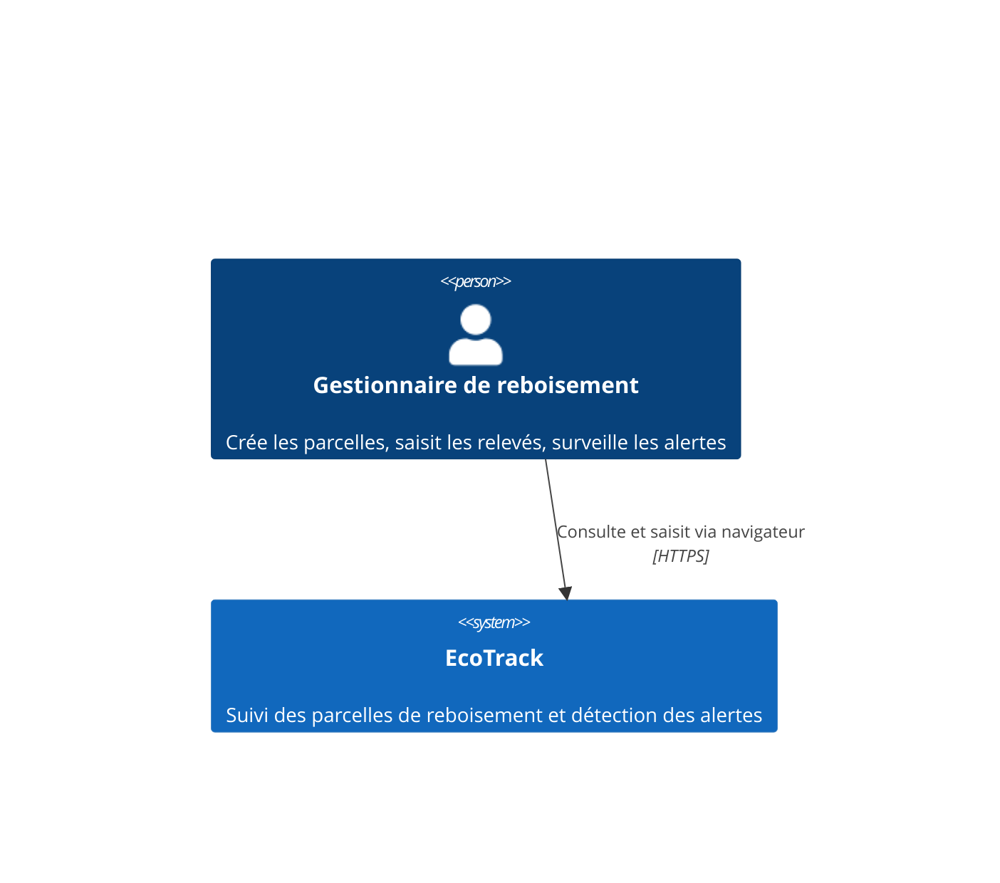
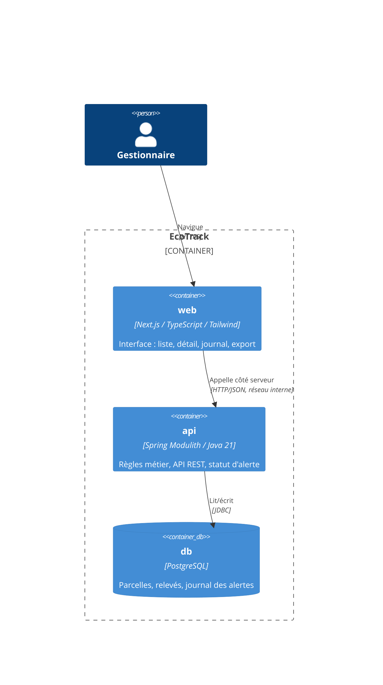
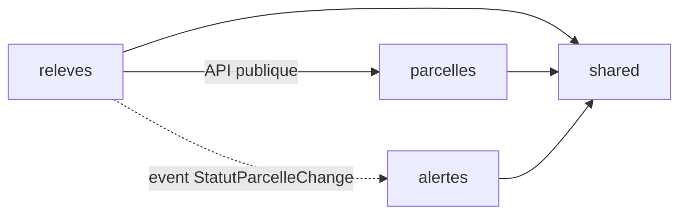

# SDD — EcoTrack : Document de Conception Logicielle
**Version 1.0 — statut : BROUILLON (en attente de revue sécurité §9)**
Source de vérité fonctionnelle : `docs/srs.md` v1.2 · Décisions : `docs/adr/` · Conventions : `CLAUDE.md`

> Ce document dit **COMMENT** on réalise ce que le SRS a défini comme **QUOI**.
> Toute décision structurante y est justifiée par une ADR. Aucune exigence ne
> doit rester sans composant ni sans test (cf. matrice §8).

---

## 1. Vue d'ensemble

### 1.1 Contexte (C4 niveau 1)



Aucun système externe en v1 (cf. SRS §2.1) : pas d'intégration SI, pas de
notification sortante, pas d'authentification (arbitrage n°1).

### 1.2 Conteneurs (C4 niveau 2)



**Décision de routage** : le navigateur ne parle **qu'au conteneur `web`**.
Next.js relaie `/api/*` vers `http://api:8080` côté serveur (variable
`API_INTERNAL_URL`). Conséquences : aucune configuration CORS, aucune URL d'API
exposée au client, et en Phase 10 l'Ingress reprend ce rôle à l'identique.

---

## 2. Architecture backend : Spring Modulith

### 2.1 Découpage en modules

Trois modules applicatifs, un module technique partagé :

```
ci.ecotrack
├── parcelles/          # module : référentiel des parcelles
├── releves/            # module : relevés + calcul du taux + statut
├── alertes/            # module : journal des changements de statut
└── shared/             # types transverses (open module)
```

**ADR-001** justifie Modulith plutôt que microservices ou monolithe en couches.
Le principe structurant : **un module ne connaît d'un autre que son API publique
ou ses events**. `ApplicationModules.verify()` transforme cette règle en test
(§7.1) — elle n'est pas une convention, c'est un check du pipeline.

| Module | Responsabilité | API publique | Cache |
|---|---|---|---|
| `parcelles` | Cycle de vie et référentiel des parcelles, unicité du code, statut courant | `ParcelleService` (création, consultation, changement de statut), `ParcelleId`, `CodeParcelle` | Entités JPA, repository, contrôleurs |
| `releves` | Enregistrement des relevés, calcul du taux de survie, détermination du statut | `ReleveService` (enregistrer, historique) | Entités JPA, règles de calcul internes |
| `alertes` | Journal immuable des changements de statut, consultation | `JournalAlertesService` (consulter) | Entités JPA, écouteur d'events |
| `shared` | `TauxDeSurvie`, `StatutParcelle` — types de valeur partagés, sans logique de module | tout (open module) | — |

### 2.2 Dépendances et events



- `releves` → `parcelles` : **dépendance directe assumée** (API publique
  uniquement). Un relevé n'a pas de sens sans sa parcelle : il doit vérifier
  son existence et lire son nombre de plants initiaux.
- `releves` → `alertes` : **jamais de dépendance directe**, uniquement l'event
  `StatutParcelleChange`. `alertes` peut disparaître sans casser `releves` —
  et une v2 « notification email » s'abonnera au même event sans toucher au
  module émetteur. **ADR-003**.
- Aucun cycle. `shared` ne dépend de personne.

**L'event** (publié par `releves`, dans son API publique) :

```java
public record StatutParcelleChange(
    ParcelleId parcelleId,
    CodeParcelle code,
    StatutParcelle ancienStatut,
    StatutParcelle nouveauStatut,
    TauxDeSurvie tauxDeclencheur,
    LocalDate dateReleve,
    Instant survenuLe) {}
```

### 2.3 Structure interne d'un module (hexagonal allégé)

```
releves/
├── ReleveService.java              # API PUBLIQUE du module (seul point d'entrée)
├── domaine/                        # Java pur — AUCUN import Spring/JPA
│   ├── Releve.java                 # entité de domaine
│   ├── TauxDeSurvie.java           # VO (dans shared)
│   └── RegleStatutAlerte.java      # règle du seuil (EX-F-03)
├── application/
│   ├── EnregistrerReleveUseCase.java
│   └── port/ReleveRepository.java  # port de sortie (interface)
└── infrastructure/
    ├── rest/ReleveController.java  # adapter entrant
    └── jpa/                        # adapter sortant : entité JPA + mapper
```

Le domaine est testable sans contexte Spring, en millisecondes. Les adapters
sont remplaçables. C'est ce qui rend `EX-F-03` (règle du seuil, cas limites)
vérifiable par des tests unitaires purs.

---

## 3. Modèle de domaine (DDD)

### 3.1 Agrégats

**Agrégat `Parcelle`** (racine, module `parcelles`) — frontière de cohérence :
code unique, caractéristiques immuables, statut courant.

```java
public class Parcelle {
    private final ParcelleId id;
    private final CodeParcelle code;          // VO : format PRC-AAAA-NNN
    private final Localite localite;          // VO : 1..100 caractères
    private final Superficie superficie;      // VO : 0.01..10000, 2 décimales
    private final NombrePlants plantsInitiaux;// VO : entier > 0
    private final LocalDate datePlantation;
    private StatutParcelle statut;            // seul état mutable
}
```

**Agrégat `Releve`** (racine, module `releves`) — référence `Parcelle` **par
identité** (`ParcelleId`), jamais par objet : deux agrégats, deux transactions,
deux modules.

```java
public class Releve {
    private final ReleveId id;
    private final ParcelleId parcelleId;      // référence par ID
    private final LocalDate dateObservation;
    private final NombrePlants plantsVivants;
    private final TauxDeSurvie taux;          // calculé, jamais saisi (EX-NF-07)
}
```

**Agrégat `EntreeJournal`** (racine, module `alertes`) — immuable par
construction (aucun setter, aucune opération de modification exposée), ce qui
réalise EX-F-07 R1 au niveau du modèle et non par convention.

### 3.2 Objets-valeur et invariants

| VO | Invariant | Exigence |
|---|---|---|
| `CodeParcelle` | `^PRC-\d{4}-\d{1,3}$`, rejet à la construction | EX-F-01 R1 |
| `Localite` | non vide, ≤ 100 caractères | EX-F-01 R4 |
| `Superficie` | `BigDecimal` ∈ [0.01, 10000], échelle 2 | EX-F-01 R3 |
| `NombrePlants` | entier > 0 (initial) ou ≥ 0 (vivants) | EX-F-01 R5, EX-F-02 R1 |
| `TauxDeSurvie` | `BigDecimal` **exact**, échelle 4 ; `estCritique()` = `valeur < 0.60` | EX-F-02 R4, EX-F-03 |

> 🔑 **Le point le plus sensible du modèle.** `TauxDeSurvie` est un `BigDecimal`
> d'échelle 4 (1199/2000 = 0.5995), **jamais un `double`, jamais un pourcentage
> arrondi**. La comparaison au seuil se fait sur cette valeur exacte ;
> l'arrondi à une décimale n'existe **que** dans le formatage d'affichage
> (couche REST/UI). C'est ce qui fait qu'une parcelle à 59,95 % passe en alerte
> tout en affichant « 60,0 % » — comportement exigé par le scénario « cas
> limite de l'arrondi » d'EX-F-03. Un `double` ici, et la règle métier devient
> non déterministe.

### 3.3 La règle de statut (cœur métier, EX-F-03)

```java
// domaine pur, testable sans Spring, sans base
public final class RegleStatutAlerte {
    public static StatutParcelle evaluer(List<Releve> releves) {
        return releves.stream()
            .max(comparing(Releve::dateObservation))   // DERNIER PAR DATE, pas par saisie
            .map(r -> r.taux().estCritique() ? EN_ALERTE : EN_SUIVI)
            .orElse(EN_SUIVI);                          // aucun relevé → EN_SUIVI
    }
}
```

Trois exigences réalisées en cinq lignes, et c'est voulu : le tri par
`dateObservation` réalise le scénario du relevé antidaté ; `estCritique()`
(strictement inférieur, valeur exacte) réalise les deux cas limites ;
`orElse(EN_SUIVI)` réalise le cas « parcelle sans relevé » (EX-F-05 R4).

### 3.4 Persistance et mapping

- **Séparation domaine / JPA** : le domaine ignore JPA ; chaque module a ses
  entités `*JpaEntity` et un mapper explicite. Coût : du code de mapping.
  Bénéfice : les invariants ne dépendent pas du cycle de vie d'Hibernate, et
  le domaine reste testable en isolation. **ADR-002**.
- **Schéma géré par Flyway uniquement**, `ddl-auto=validate` sur tous les
  profils. Migrations `V1__creation_schema.sql`, etc. Règle *expand/contract*
  obligatoire (rolling update = deux versions coexistantes, EX-NF-02).
- **Contraintes en base**, pas seulement en Java : `UNIQUE(code)` sur
  `parcelle` (EX-F-01 R2), `UNIQUE(parcelle_id, date_observation)` sur `releve`
  (EX-F-02 R3) — la base est le dernier rempart contre les écritures
  concurrentes que la validation applicative ne voit pas.
- **Index** : `releve(parcelle_id, date_observation DESC)` pour l'historique
  et le dernier relevé ; `parcelle(statut, code)` pour le tri par défaut de la
  liste (EX-F-05 R1, EX-NF-01).

> ⚠️ **Piège de performance à traiter dès la conception** : afficher la liste
> paginée avec le dernier taux de chaque parcelle est un N+1 classique
> (1 requête + 50 requêtes de relevés). Solution retenue : le **dernier taux
> et la date du dernier relevé sont dénormalisés sur la ligne `parcelle`**,
> mis à jour par le même use case qui enregistre le relevé. Justifié par
> EX-NF-01 (P95 < 500 ms sur la liste, jusqu'à 5 000 parcelles).
> Contrepartie assumée : redondance contrôlée, dans une seule transaction.

---

## 4. Contrat d'API REST

Contrat faisant foi entre `web` et `api` (EI-02). Base : `/api/v1`.
Erreurs au format **RFC 7807** (`application/problem+json`), sans détail
interne (EX-NF-05).

| Méthode | Ressource | Codes | Exigence |
|---|---|---|---|
| `POST` | `/parcelles` | 201, 400, 409 | EX-F-01 |
| `GET` | `/parcelles?page=0&size=50` | 200, 400 | EX-F-05 |
| `GET` | `/parcelles/{code}` | 200, 404 | EX-F-06 |
| `POST` | `/parcelles/{code}/releves` | 201, 400, 404, 409 | EX-F-02 |
| `GET` | `/parcelles/{code}/releves` | 200, 404 | EX-F-06 |
| `GET` | `/alertes?page=0&size=50` | 200 | EX-F-07 |
| `GET` | `/parcelles/export.csv` | 200, 404 (flag OFF) | EX-F-04 |
| `GET` | `/actuator/health`, `/actuator/info` | 200 | EX-NF-04 |

**Création d'une parcelle** :

```http
POST /api/v1/parcelles
{ "code": "PRC-2026-042", "localite": "Bingerville",
  "superficie": 12.50, "plantsInitiaux": 2000, "datePlantation": "2026-06-15" }

201 Created
{ "code": "PRC-2026-042", "localite": "Bingerville", "superficie": 12.50,
  "plantsInitiaux": 2000, "datePlantation": "2026-06-15",
  "statut": "EN_SUIVI", "dernierTaux": null, "dateDernierReleve": null }
```

**Liste paginée** (EX-F-05 : tri alertes d'abord puis code croissant) :

```http
GET /api/v1/parcelles?page=0&size=50

200 OK
{ "contenu": [
    { "code": "PRC-2026-043", "localite": "Adzopé", "statut": "EN_ALERTE",
      "dernierTaux": 59.9, "dateDernierReleve": "2026-07-22" },
    { "code": "PRC-2026-042", "localite": "Bingerville", "statut": "EN_SUIVI",
      "dernierTaux": null, "dateDernierReleve": null } ],
  "page": 0, "taille": 50, "total": 2, "totalPages": 1 }
```

> `dernierTaux` est un **nombre déjà arrondi à une décimale pour l'affichage**
> (59.9), tandis que le statut provient de la valeur exacte (0.5995) — c'est
> exactement le cas limite d'EX-F-03 : le contrat assume que taux affiché et
> statut peuvent sembler incohérents. `null` signifie « aucun relevé », jamais 0.

**Erreur de validation** :

```http
400 Bad Request
{ "type": "about:blank", "title": "Requête invalide", "status": 400,
  "detail": "Le code doit respecter le format PRC-AAAA-NNN",
  "champs": [ { "champ": "code", "message": "format invalide" } ] }
```

**Codes 409** : conflit d'unicité — code de parcelle déjà utilisé (EX-F-01 R2),
relevé déjà existant à cette date (EX-F-02 R3).

**Aucun champ `statut` ni `taux` n'est acceptable en écriture** sur les
ressources — vérifié par revue de contrat et par test (EX-NF-07).

---

## 5. Conception frontend (Next.js)

### 5.1 Écrans et traçabilité

| Écran | Route | Endpoints | Exigences | Rendu |
|---|---|---|---|---|
| Liste des parcelles | `/` | `GET /parcelles` | EX-F-05, EX-NF-01 | Server Component |
| Détail + historique | `/parcelles/[code]` | `GET /parcelles/{code}`, `.../releves` | EX-F-06 | Server Component |
| Création de parcelle | `/parcelles/nouvelle` | `POST /parcelles` | EX-F-01 | Client Component (formulaire) |
| Saisie d'un relevé | `/parcelles/[code]/releves/nouveau` | `POST .../releves` | EX-F-02 | Client Component |
| Journal des alertes | `/alertes` | `GET /alertes` | EX-F-07 | Server Component |
| Export CSV | action sur `/` | `GET /parcelles/export.csv` | EX-F-04 | bouton conditionné au flag |

### 5.2 Couche d'accès à l'API

`src/lib/api.ts` : **unique** point d'appel au backend, schémas **zod** dérivés
du contrat §4. Aucun `fetch` dans un composant, aucun `any` (CLAUDE.md).

```typescript
const ParcelleResume = z.object({
  code: z.string().regex(/^PRC-\d{4}-\d{1,3}$/),
  localite: z.string(),
  statut: z.enum(["EN_SUIVI", "EN_ALERTE"]),
  dernierTaux: z.number().nullable(),        // null = aucun relevé (EX-F-05 R4)
  dateDernierReleve: z.string().nullable(),
});
```

**Rôle de zod** : si l'API dévie du contrat, l'erreur est explicite et testable,
au lieu d'un `undefined` silencieux dans l'UI. Le contrat du SDD est ainsi
vérifié **des deux côtés**.

### 5.3 Feature flag côté interface

Le bouton d'export ne doit apparaître que si le flag est actif (EX-F-04 R1).
Le front n'a pas de configuration propre : il interroge `GET /api/v1/config`
qui expose les flags publics. **Une seule source de vérité** — le backend.
**ADR-004**.

### 5.4 Accessibilité (EX-NF-06)

Le badge d'alerte combine **couleur + texte + icône** (jamais la couleur seule),
contraste ≥ 4,5:1, `aria-label` explicite. États `loading` / `empty` / `error`
implémentés sur chaque écran via `loading.tsx` et `error.tsx` (App Router).

---

## 6. Configuration, profils et déploiement

| Profil | Base | Usage |
|---|---|---|
| `dev` | H2 en mode PostgreSQL | poste de développement |
| `test` | H2 en mode PostgreSQL, schéma Flyway | tests automatisés |
| `staging` | PostgreSQL | environnement de vérification |

Toute configuration sensible par variable d'environnement (jamais dans le code
ni dans une image). Flags : `ecotrack.features.export-csv` (défaut : `false`).

**Sondes** (EX-NF-02) : `readiness` conditionne la réception du trafic,
`liveness` le redémarrage — distinction indispensable au rolling update.
**Version** (EX-NF-04) : `build-info` Maven → `/actuator/info` ;
`NEXT_PUBLIC_VERSION` → pied de page web ; cohérence vérifiée par test.

---

## 7. Stratégie de tests

### 7.1 Pyramide

| Niveau | Outil | Portée | Où |
|---|---|---|---|
| Domaine pur | JUnit 5 | VO, `RegleStatutAlerte`, invariants, **cas limites** | PR |
| Architecture | `ApplicationModules.verify()` | frontières et cycles entre modules | PR |
| Module | `@ApplicationModuleTest` + `Scenario` | use cases, publication et réception d'events | PR |
| Adapters | `@WebMvcTest`, `@DataJpaTest` | contrat REST, mapping, contraintes SQL | PR |
| Front unitaire | vitest + Testing Library | composants, états, badge | PR |
| API bout-en-bout | RestAssured | scénarios Gherkin du SRS sur staging réel | post-déploiement |
| Navigateur | Playwright | parcours complets navigateur → API → BDD | post-déploiement |
| Charge | k6 / JMeter | EX-NF-01 (détail **et** liste) | post-déploiement |

### 7.2 Tests non négociables (issus des pièges du SRS)

1. `should_passer_en_alerte_when_taux_est_5995_pourcent` — 1199/2000, domaine pur.
2. `should_rester_en_suivi_when_taux_exactement_60_pourcent` — 1200/2000.
3. `should_ignorer_releve_antidate_when_determine_statut`.
4. `should_rester_en_suivi_when_aucun_releve`.
5. `should_journaliser_alerte_when_crash_apres_enregistrement` — EX-NF-03,
   vérifie la reprise de l'event au redémarrage.
6. `should_afficher_tiret_when_parcelle_sans_releve` (front).

---

## 8. Matrice de traçabilité exigence → composant → test

| Exigence | Composant | Test |
|---|---|---|
| EX-F-01 | `parcelles` : `CodeParcelle`, `Superficie`, `Localite`, `ParcelleService`, `POST /parcelles` | unitaires VO, `@WebMvcTest`, `@DataJpaTest` (unicité), e2e |
| EX-F-02 | `releves` : `Releve`, `TauxDeSurvie`, `EnregistrerReleveUseCase` | unitaires, module, `@DataJpaTest` (doublon date), e2e |
| EX-F-03 | `releves` : `RegleStatutAlerte` + event `StatutParcelleChange` | unitaires **cas limites**, `@ApplicationModuleTest` |
| EX-F-04 | `parcelles` : export CSV sous flag ; bouton conditionné front | `@WebMvcTest` flag ON/OFF, vitest, e2e |
| EX-F-05 | `parcelles` : liste paginée triée + colonnes dénormalisées ; écran `/` | `@DataJpaTest` (tri/pagination), vitest, Playwright |
| EX-F-06 | `releves` : historique ; écran `/parcelles/[code]` | `@WebMvcTest`, vitest, Playwright |
| EX-F-07 | `alertes` : `EntreeJournal`, écouteur d'event, écran `/alertes` | `@ApplicationModuleTest`, Playwright |
| EX-NF-01 | index BDD + dénormalisation + pagination | test de charge staging (détail **et** liste) |
| EX-NF-02 | sondes readiness/liveness, migrations expand/contract | tests pendant déploiement réel |
| EX-NF-03 | event publication registry (Modulith) | test de crash/reprise |
| EX-NF-04 | `build-info` + `NEXT_PUBLIC_VERSION` | test post-déploiement de cohérence |
| EX-NF-05 | validation VO + `@Valid` + RFC 7807 | tests des cas d'erreur de chaque EX-F |
| EX-NF-06 | badge couleur+texte+icône, états UI | vitest + audit accessibilité |
| EX-NF-07 | aucun champ statut/taux en écriture | revue de contrat + `@WebMvcTest` |

**Aucune exigence du SRS v1.2 n'est orpheline.**

---

## 9. Points ouverts pour la revue sécurité (§2.4 du TP)

À soumettre à l'agent `security-reviewer` avant tout code :
1. Absence d'authentification (arbitrage n°1) : quel risque en staging exposé ?
2. Export CSV : injection de formule (CSV injection) sur le champ `localite` ?
3. Pagination : `size` non borné = déni de service potentiel — borne max à fixer.
4. Messages d'erreur RFC 7807 : ne pas fuiter de contrainte SQL ni de version.
5. Journal des alertes : donnée à conserver combien de temps ?

---

*Historique : v1.0 — conception initiale tracée sur SRS v1.2.
Toute évolution passe par une Pull Request référencée.*
